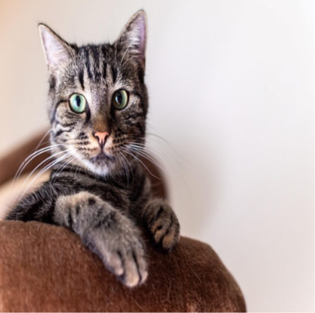
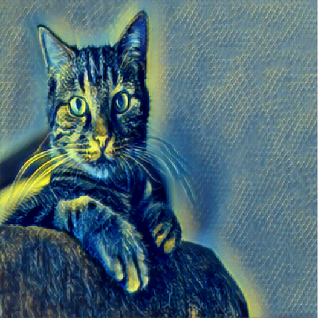

#  Neural Style Transfer (NST)

This project implements **Neural Style Transfer** using **Deep Learning** to blend the *content* of one image with the *artistic style* of another. The model generates visually appealing stylized images by leveraging feature representations learned by a convolutional neural network.

---

##  Project Overview

Neural Style Transfer (NST) is a computer vision technique that applies the style of one image (such as a painting) to another image while preserving its original content.  
This project uses a **VGG-based CNN architecture** and optimizes an output image by minimizing **content loss** and **style loss**.

---

## 🔗 Live Demo

 **Try the application here:**  
https://your-app-link.com

--- 

##  Features

- Transfer artistic style from any image to a content image
- Uses pretrained CNN (VGG) for feature extraction
- Adjustable style and content weights
- Saves intermediate and final stylized outputs

---

##  How It Works

1. A **content image** and a **style image** are loaded
2. A pretrained **VGG network** extracts feature maps
3. Content loss preserves structure from the content image
4. Style loss (using Gram matrices) captures artistic patterns
5. The generated image is iteratively optimized to minimize total loss

---

##  Project Structure
├── train.py / style_transfer.py <br>
├── models/<br>
│ └── vgg.py<br>
├── images/<br>
│ ├── content/<br>
│ ├── style/<br>
│ └── output/<br>
├── requirements.txt<br>
└── README.md

---

## Installation & Setup

### Clone the Repository
```bash
git clone https://github.com/your-username/neural-style-transfer.git
cd neural-style-transfer
```

### Install Dependencies
```bash
pip install -r requirements.txt
```
### Usage

1. Place your images:

- Content image → images/content/

- Style image → images/style/

2. Run the script:
```bash
python train.py
```
3. Stylized images will be saved in:
```bash
images/output/
```
---

##  Sample Results

### Content Image


### Style Image


### Stylized Output


---

## Results

The model successfully produces stylized images that retain the structural content of the original image while adopting textures, colors, and patterns from the style image.
